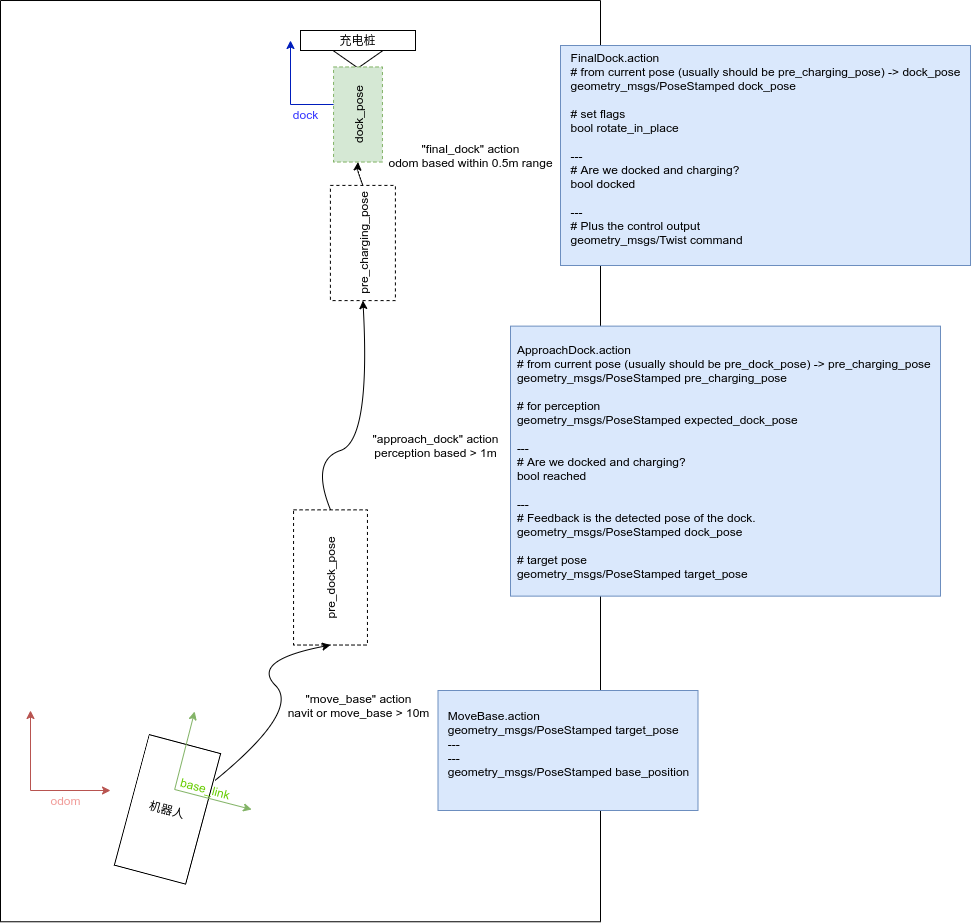
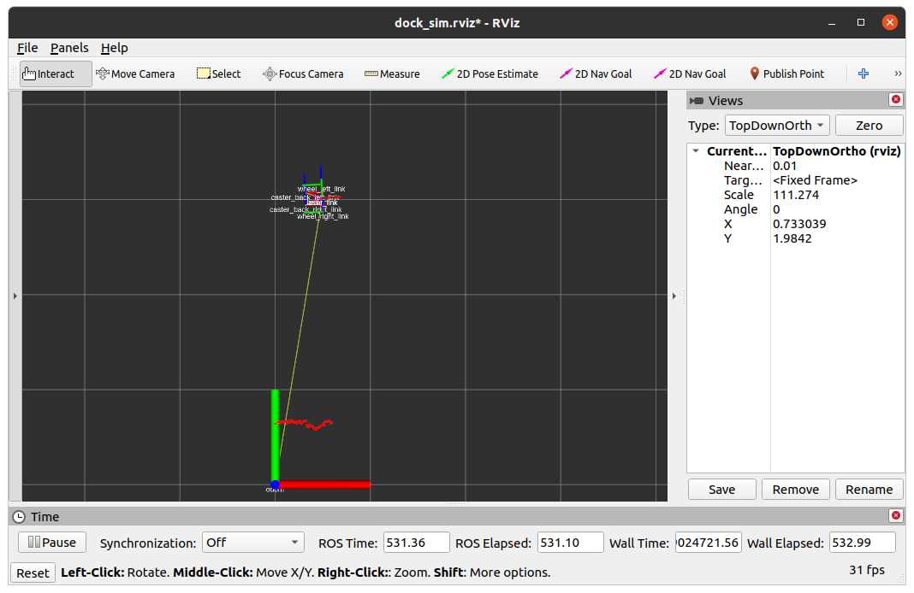
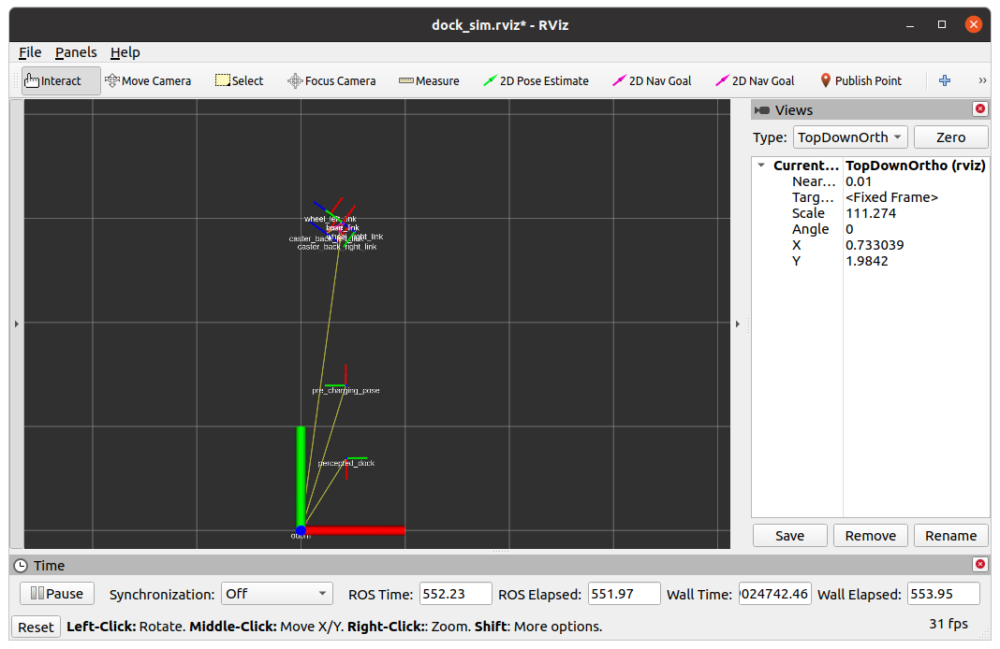
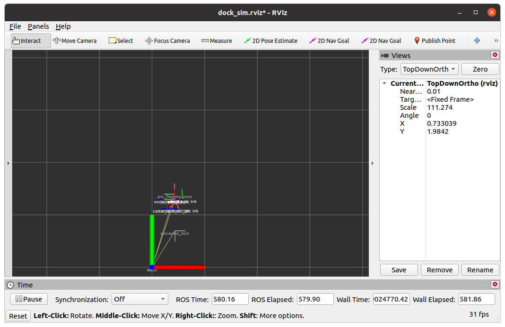

# 自动回充功能包（navit_auto_dock）
该模块实现移动机器人的自动回充功能




## 1. 该模块实现在全局地图下的路径规划功能，包括：

1. 接近充电桩的对桩算法（approach_dock），不依赖地图和全局定位，但是必须要有相应的桩位特征比如二维码，V槽等，运动过程中车相对于特征位置定位闭环。
2. 在终点之前简单后退（前进）进行微调的控制算法（final_dock）,不依赖地图和全局定位，也不需要桩位特征，纯靠里程计盲走一小段距离，在里程计下定位闭环。

## 2. ros重要接口说明

1. 提供ros ActionServer /approach_dock：

```yaml

ActionGoal:
    # for perception
    geometry_msgs/PoseStamped expected_dock_pose

    string controller_plugin_name
    string perception_plugin_name
    string filter_plugin_name

ActionResult:
    # Are we successfully docked?
    bool reached

ActionFeedback:

    # Feedback is the detected pose of the Qr_code or V_slot.
    geometry_msgs/PoseStamped dock_pose

    # target pose
    geometry_msgs/PoseStamped target_pose 
```

2. 提供ros ActionServer /final_dock

```yaml

ActionGoal:
    # from current pose  -> dock_pose
    geometry_msgs/PoseStamped dock_pose

    # set flags
    bool rotate_in_place

ActionResult:
    # Are we successfully docked?
    bool docked

ActionFeedback:
    # For visualization only
    geometry_msgs/PoseStamped dock_pose_feedback

    # Plus the control output
    geometry_msgs/Twist command

```


## 3. 重要插件说明


| controller 插件类型   | 说明 |
| :----- | :--: | 
| dock_diff_purepursuit_pid_controller/Controller |  差分车几何型控制方式 | 
| dock_diff_graceful_controller/Controller |  一种基于优雅的差分车的控制方式 | 
| dock_fg100_controller/FgController|  阿克曼/差分车的控制方式 | 

| perception 插件类型   | 说明 |
| :----- | :--: | 
| dock_fake_perception/FakePerception| 虚拟发布一个识别定位信息，用于纯规控的调试 | 
| dock_perception/Perception| 激光实时识别V槽的位置 | 
| dock_visual_perception/VisualPerception | 相机实时识别二维码的位置 |

| filter 插件类型   | 说明 |
| :----- | :--: | 
| PerceptionEKF| 卡尔曼滤波 | 
| AverageFilter | 平均滤波 | 


## 4. launch说明

> roslaunch navit_auto_dock auto_dock_simulation_d100_gazabo.launch

节点都起来之后，具体情况如下图：




在rviz中选择一个pose（带方向，一般是V槽的正中心向里）这个位姿代表估计的特征点坐标，作为滤波的初始值



车会在进行完approach_dock之后会继续一个final_dock，最终会停在V槽之前




> roslaunch navit_auto_dock auto_dock_simulation_d100_stage.launch

效果与上述相同，区别是仿真环境用的stage，在rviz里面那个2DPose可以随便点作为终点。

> roslaunch navit_bt_navigator auto_dock_bt_trees_simulation_d100_gazabo.launch

> roslaunch navit_bt_navigator client_bt_auto_dock_simulation.launch

先起自动回充navit_auto_dock_node，gazebo环境及rviz可视化，再通过行为树client调用相应的回充行为树xml文件,
xml文件中指定了expected_dock_pose，及控制器插件、感知、滤波插件等。


## 5. test说明

> rostest navit_planner auto_dock.test

会测试一个差分车在odom下后退一小段

```xml
// FileName: test/auto_dock.test
  <!-- Test if a specific topic is published in a given frequency. -->
  <test pkg="rostest"  test-name="tfHzTest" type="hztest" name="tfHzTest" >
    <param name="topic" value="/cmd_vel" />  
    <param name="hz" value="10" />
    <param name="hzerror" value="2" />
    <param name="test_duration" value="10.0" />
  </test>
 <!-- Test if a specific topic is published at least once in a time. -->
  <test pkg="rostest" name="publishtest" test-name="publishtest" type="publishtest">
    <rosparam>
      topics:
        - name: approach_action_succeed
          timeout: 60
          negative: False # Test will success if it is published within the timeout
        - name: final_action_succeed
          timeout: 60
          negative: False # Test will success if it is published within the timeout
    </rosparam>
  </test>

```