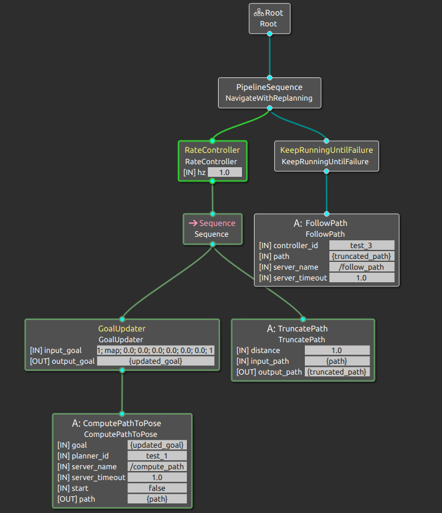

# BT Navigator

## Navigate following a dynamic point
This tree is an example of how behavior trees can be used to make the robot do more than navigate the current position to the desired pose. In this case, the robot will follow a point that changes dynamically during the execution of the action. The robot will stop its advance and will be oriented towards the target position when it reaches a distance to the target established in the tree. The UpdateGoal decorator node will be used to update the target position. The TruncatePath node will modify the generated path by removing the end part of this path, to maintain a distance from the target, and changes the orientation of the last position. This tree never returns that the action has finished successfully, but must be canceled when you want to stop following the target position.

### Launch CMD: roslaunch navit_bt_navigator robot_diff_drive_in_stage.launch

## Navigate simple_navigator -- AutoDock & RecoveryBehavior
This tree is an example of how behavior trees can be used to make the robot do more than navigate the current position to the desired pose. In this case, the robot will follow a point that changes dynamically during the execution of the action. The robot will stop its advance and will be oriented towards the target position when it reaches a distance to the target established in the tree. 
The UpdateGoal decorator node will be used to update the target position.
The TruncatePath node will modify the generated path by removing the end part of this path, to maintain a distance from the target, and changes the orientation of the last position.
The ApproachDock and FinalDock node will be used to dock charger.

### Launch CMD: roslaunch navit_bt_navigator robot_diff_drive_in_stage.launch

## Navigate simple_navigator -- AutoDock & RecoveryBehavior
This tree is an example of how behavior trees can be used to make the robot do more than navigate the current position to the desired pose. In this case, the robot will follow a point that changes dynamically during the execution of the action. The robot will stop its advance and will be oriented towards the target position when it reaches a distance to the target established in the tree.
The UpdateGoal decorator node will be used to update the target position.
The TruncatePath node will modify the generated path by removing the end part of this path, to maintain a distance from the target, and changes the orientation of the last position.
The ApproachDock and FinalDock node will be used to dock charger.

### Launch CMD: roslaunch navit_bt_navigator robot_diff_drive_in_stage.launch

BT action