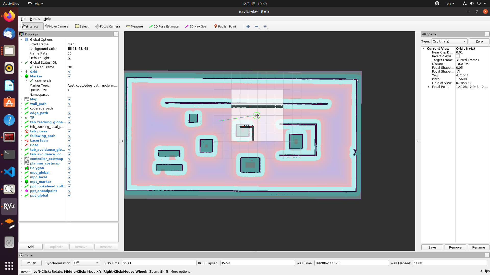
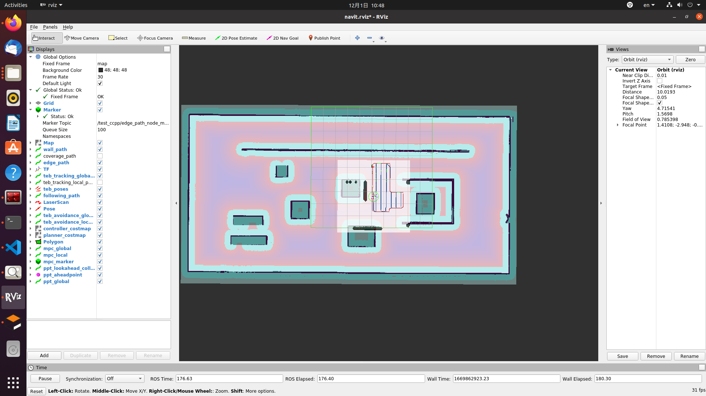
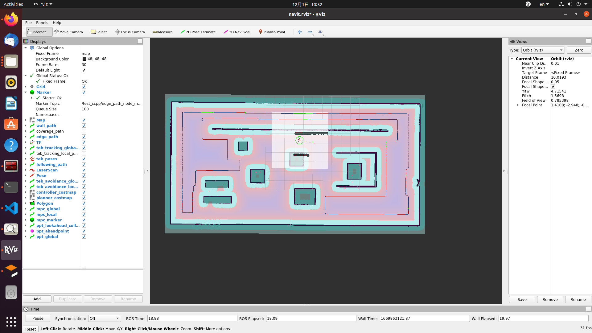

# 行为树仿真使用说明：启动gazebo仿真服务，再通过调用不同功能的行为树客户端，测试全覆盖，沿墙，点到点
## 1. 启动gazebo仿真服务，rviz等
> roslaunch navit_bt_navigator  simulation_p2p_coverage_gazebo.launch

## 2. 测试点到点功能
> roslaunch navit_bt_navigator client_bt_to_point.launch

## 3. 测试全覆盖功能
> roslaunch navit_bt_navigator client_bt_to_point.launch

## 4. 测试沿墙功能
> roslaunch navit_bt_navigator client_bt_to_point.launch

