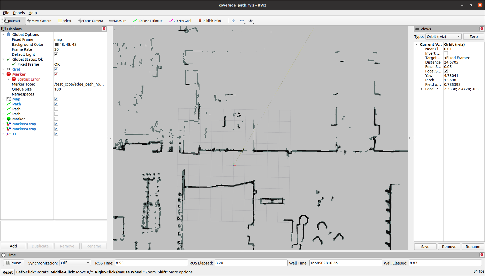
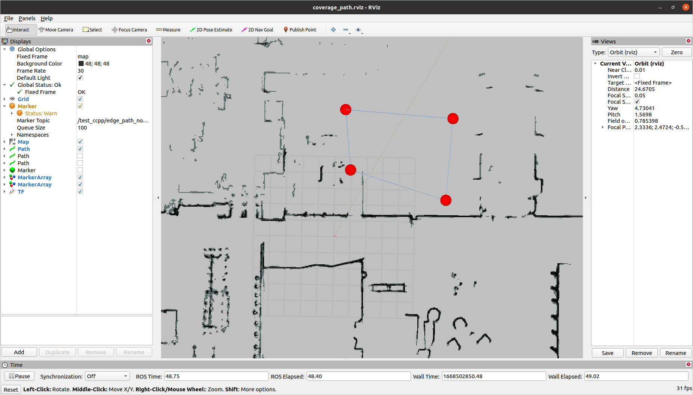
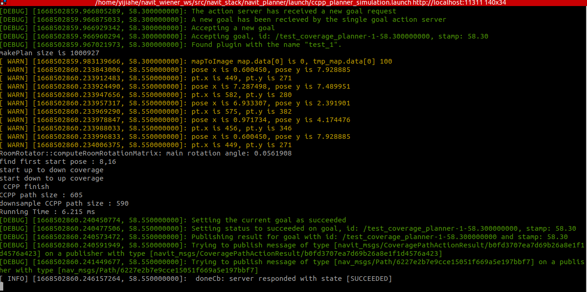
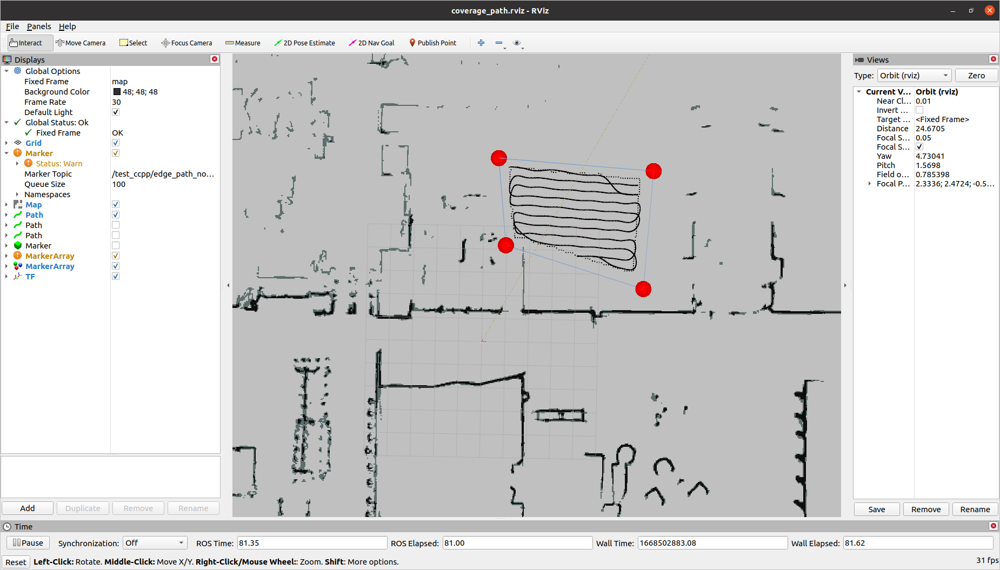
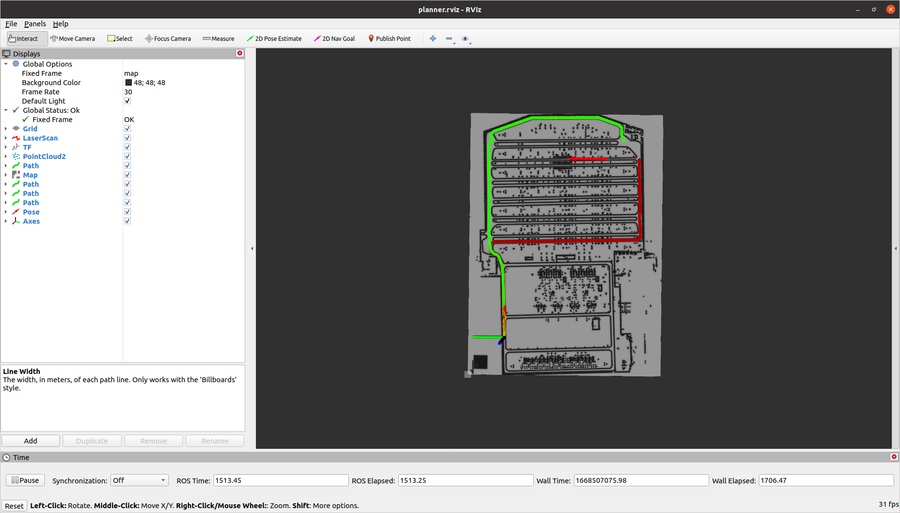
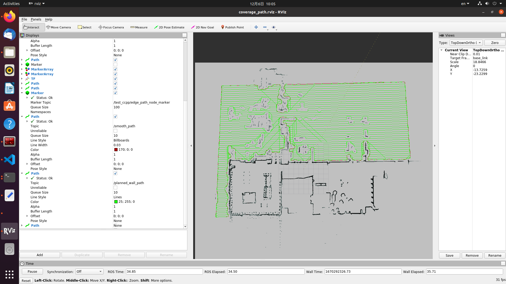

# 全局规划器功能包（navit_planner）
## 1. 该模块实现在全局地图下的路径规划功能，包括：

1. 在给定地图，给定区域下生成全覆盖路径。
2. 在给定地图，给定区域内生成沿墙路径。
3. 在给定地图下规划出点到点，并且避开障碍物的路径。
4. 在给定地图下规划出从当前位置到目标点，并且避开障碍物的路径。

## 2. ros重要接口说明

1. 提供ros ActionServer /compute_path：

```yaml

ActionGoal:
    # 起点
    geometry_msgs/PoseStamped start

    # 终点
    geometry_msgs/PoseStamped goal

    # 选择插件
    string planner_plugin

    # 是否使用给定点为起点
    bool use_start
ActionResult:

    # 是否成功
    bool path_found

    # 规划结果
    nav_msgs/Path path

    # 规划用时
    std_msgs/Duration planning_used_time

    #TODO:增加一些状态量定义用来反馈结果

ActionFeedback:

    # 反馈(暂无）
    # TODO：反馈
```

2. 提供ros ActionServer /coverage_path

```yaml

ActionGoal:
    # 待规划的地图
    nav_msgs/OccupancyGrid map

    # 包围的边界 
    nav_msgs/Path edge_path

    # 选择插件
    string planner_plugin
    
ActionResult:

    # 是否成功
    bool path_found

    # 规划结果
    nav_msgs/Path coverage_path #这是全覆盖结果
    nav_msgs/Path wall_path #这是沿墙结果

    # 规划用时
    std_msgs/Duration planning_used_time

    #TODO:增加一些状态量定义用来反馈结果

ActionFeedback:

    # 反馈(暂无）
    # TODO：反馈

```


## 3. 重要插件说明


| coverage_planner插件类型   | 说明 |
| :----- | :--: | 
| complete_coverage_planner/CompleteCoveragePlanner |  弓字形全覆盖 | 

| nav_planner插件类型   | 说明 |
| :----- | :--: | 
| navfn/NavfnROS|  又是全局规划器，Dijkstra | 
| global_planner/GlobalPlanner |  全局规划器，A*，Dijkstra | 
| smac_planner/SmacPlanner| 双是一种全局规划器，A*，Hybrid-A*，State Lattice |
| tpspace_rrt_planner/TpspaceRRT| 叒是一种全局规划器，RRT |


## 4. launch说明

> roslaunch navit_planner ccpp_planner_simulation.launch

在一个特定的地图文件中生成制定区域的全覆盖和延边的路径，具体操作如下：



在rviz中选择n个点，框选出一个区域，注意要形成闭环,最后一个publish point 要再选第一个点



在启动窗口点击'e'是生成路径，按q是回退选点



回到rviz即可看到生成的路径，虚线为沿墙路线，实线为全覆盖路径



> roslaunch navit_planner navit_planner_simulation.launch

此launch会验证各种规划器规划效果，launch起来之后就会随机不断生成各种地图上的点作为目标点，几种不同颜色的路径代表不同的规划器规划出来的路径，目前测试了以下四种planner
```yaml

nav_planner:
     - name: test_1
       type: navfn/NavfnROS 
     - name: test_2
       type: global_planner/GlobalPlanner 
     - name: test_3
       type: smac_planner/SmacPlanner2D
     - name: test_4
       type: smac_planner/SmacPlanner

```



> roslaunch navit_planner ccpp_planner_simulation_python_client.launch
启动全覆盖服务和客户端（python）,直接发布特定点，在地图上规划出全覆盖路径,把生成的wall_path给到smooth_path的rough_path,会生成光滑的/smooth_path，具体planner参数如下
```yaml
coverage_planner:
     - name: test_1
       type: complete_coverage_planner/CompleteCoveragePlanner
    
     - name: test_2
       type: complete_coverage_planner/CompleteCoveragePlanner

     - name: test_3
       type: complete_coverage_planner/CompleteCoveragePlanner

smooth_path_planner:
     - name: test_4
       type: path_smoother/PathGslSpline

```


## 5. test说明

> rostest navit_planner ccpp_planner.test

会测试在一张给定地图下的给定区域内是否能生成全覆盖路径和沿墙路径，同时把生成的wall_path给到smooth_path的rough_path,会生成光滑的/smooth_path,如果/smooth_path_action_succeed结果正常则测试通过

```xml
// FileName: ccpp_planner.test
 <!-- Test if a specific topic is published at least once in a time. -->
  <test pkg="rostest" name="publishtest" test-name="publishtest" type="publishtest">
    <rosparam>
      topics:
        - name: /action_succeed
          timeout: 20
          negative: False # Test will success if it is published within the timeout
        - name: /test_ccpp/coverage_path
          timeout: 20
          negative: False # Test will success if it is published within the timeout
        - name: /test_ccpp/wall_path
          timeout: 20
          negative: False # Test will success if it is published within the timeout
        - name: /smooth_path_action_succeed
          timeout: 30
          negative: False # Test will success if it is published within the timeout
        - name: /smooth_path
          timeout: 30
          negative: False # Test will success if it is published within the timeout
    </rosparam>
  </test>
```

> rostest navit_planner navit_planner.test

会测试在一张给定地图下给定随机终点然后用不同的规划器规划出结果，还会检查一些重要参数是否正确和重要话题是否发布，如果结果都正常则测试通过。

```xml
// FileName: navit_planner.test

  <!-- Test if a specific topic is published in a given frequency. -->
  <test pkg="rostest"  test-name="tfHzTest" type="hztest" name="tfHzTest" >
    <param name="topic" value="/tf" />  
    <param name="hz" value="80" />
    <param name="hzerror" value="10" />
    <param name="test_duration" value="5.0" />
  </test>

  <test pkg="rostest" test-name="odomHzTest" type="hztest" name="odomHzTest" >
    <param name="topic" value="/odom" />  
    <param name="hz" value="20" />
    <param name="hzerror" value="3" />
    <param name="test_duration" value="5.0" />
  </test>

 <!-- Test if a specific topic is published at least once in a time. -->
  <test pkg="rostest" name="publishtest" test-name="publishtest" type="publishtest">
    <rosparam>
      topics:
        - name: compute_path/result
          timeout: 20
          negative: False # Test will success if it is published within the timeout
        - name: planned_path
          timeout: 15
          negative: False # Test will success if it is published within the timeout
        - name: /navit_planner_node/test_1/plan
          timeout: 30
          negative: false  # Test will success if it is not published until the timeout
        - name: /navit_planner_node/test_2/plan
          timeout: 30
          negative: false  # Test will success if it is not published until the timeout
        - name: /navit_planner_node/test_3/unsmoothed_plan
          timeout: 30
          negative: false  # Test will success if it is not published until the timeout
        - name: /navit_planner_node/test_4/unsmoothed_plan
          timeout: 30
          negative: false  # Test will success if it is not published until the timeout         
    </rosparam>
  </test>

  <!-- Test if a specific parameter is not empty. -->
  <test pkg="rostest" type="paramtest" name="paramtest_nonempty"  test-name="paramtest_nonempty">
    <param name="param_name_target" value="/navit_planner_node/planner_costmap/robot_base_frame" />
    <param name="test_duration" value="5.0" />
    <param name="wait_time" value="20.0" />
  </test>


  <!-- Test if a specific parameter carries a specific value. -->
  <test pkg="rostest" type="paramtest" name="paramtest_value_specific_correct"  test-name="paramtest_value_specific_correct">
    <param name="param_name_target" value="/navit_planner_node/planner_costmap/obstacle_layer/enabled" />
    <param name="param_value_expected" value="true" />
    <param name="test_duration" value="5.0" />
    <param name="wait_time" value="30.0" />
  </test>
```